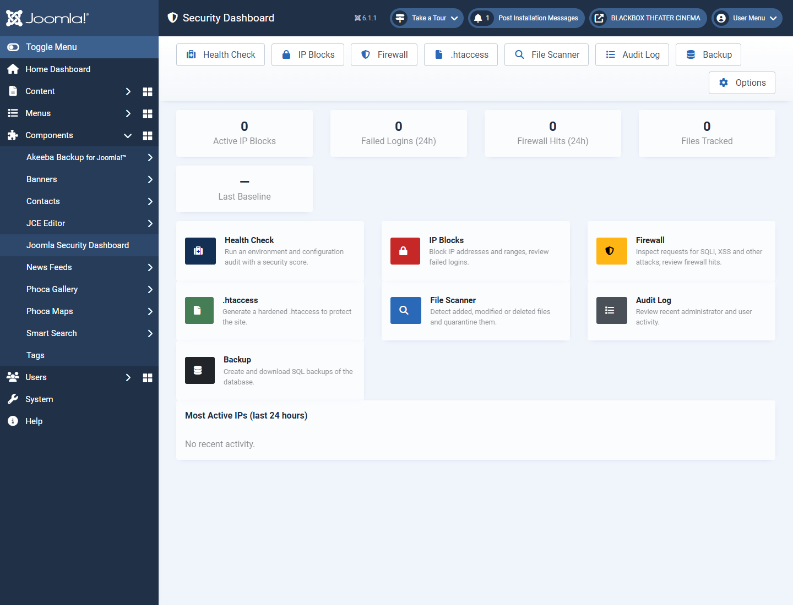
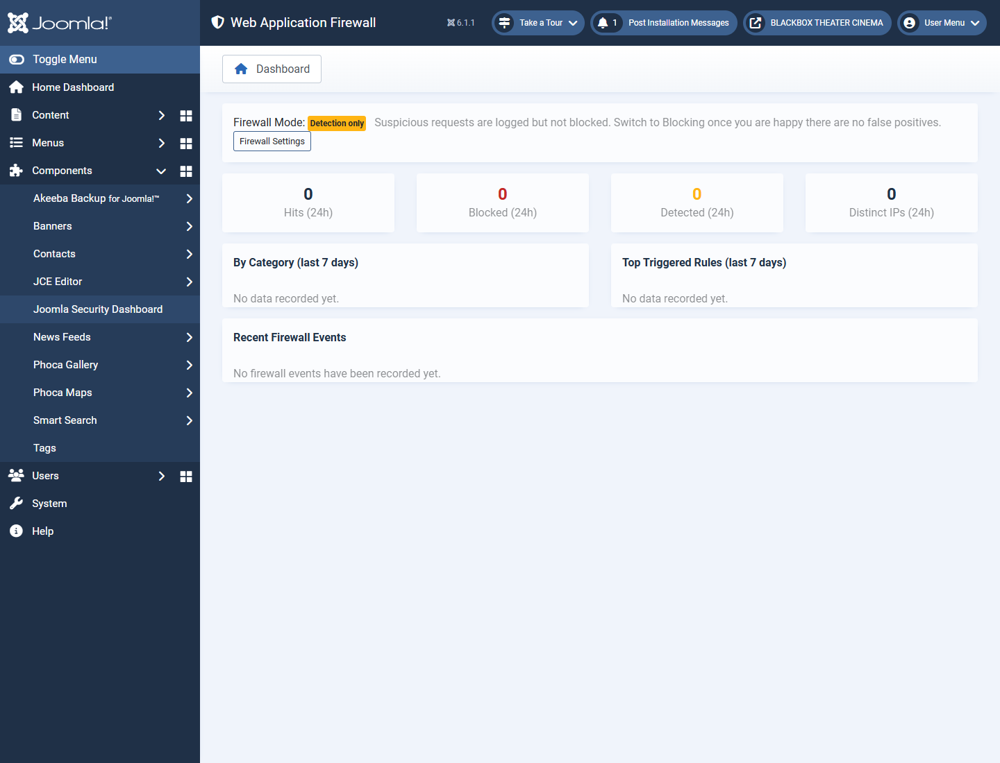
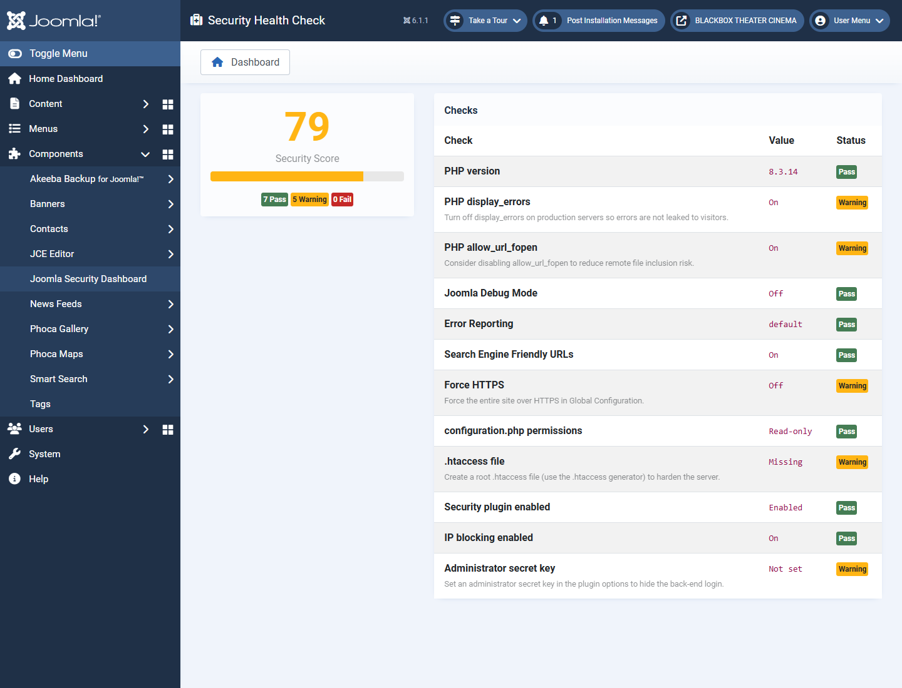
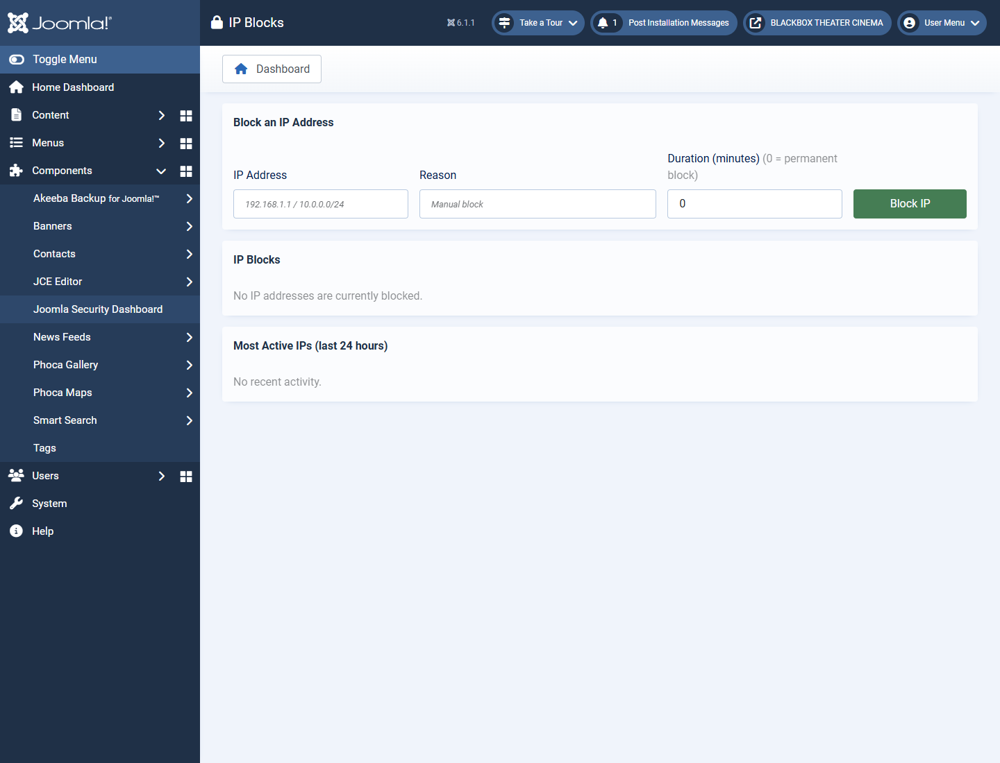

<p align="center">
  
</p>

<h1 align="center">Joomla Security Dashboard</h1>

<p align="center">
  Login lockout · IP blocking · Web Application Firewall · .htaccess hardening ·
  file integrity scanning · audit log · database backup — in one dashboard.
</p>

<p align="center">
  <a href="https://github.com/npsaltakis/Joomla-Security-Dashboard/actions/workflows/release.yml">
    </a>
  <a href="https://github.com/npsaltakis/Joomla-Security-Dashboard/releases">
    </a>
  
  
  <a href="LICENSE.txt"></a>
</p>

---

A security suite for **Joomla 5 and Joomla 6**, delivered as a single installable package containing:

- **`com_jsecdash`** — administrator component (dashboard UI): security health check, IP
  blocks, **Web Application Firewall**, `.htaccess` generator, file integrity scanner,
  audit log and database backup.
- **`plg_system_jsecdash`** — system plugin (the enforcement engine): login lockout,
  IP blocking, admin-secret URL, and the WAF request inspection / logging.

## ✨ Features

| | Feature | Description |
| :-: | --- | --- |
| 📊 | **Dashboard** | At-a-glance counters (active blocks, failed logins, WAF hits, tracked files) and most-active IPs. |
| 🩺 | **Health Check** | Environment & configuration audit with a 0–100 security score and recommendations. |
| ⛔ | **IP Blocks** | Manual & automatic blocking of single IPs, CIDR ranges and hyphenated ranges. |
| 🛡️ | **Web Application Firewall** | Inspects every request for SQLi, XSS, LFI/traversal, command injection, scanners and known exploit paths. Detect / Block modes, logging and escalation to IP blocks. |
| 📄 | **.htaccess Generator** | One-click hardening rules with automatic timestamped backups & restore. |
| 🔎 | **File Scanner** | SHA-256 baseline & integrity scan with quarantine/restore of suspicious files. |
| 📝 | **Audit Log** | Reviews recent administrator/user activity from the core action log. |
| 💾 | **Database Backup** | On-demand SQL dumps of all site tables, stored in a protected folder. |

## 📸 Screenshots

| Dashboard | Web Application Firewall |
| --- | --- |
|  |  |

| Health Check | IP Blocks |
| --- | --- |
|  |  |

> Screenshots live in [`docs/screenshots/`](docs/screenshots/). See that folder for the
> expected file names if you want to refresh them.

## ✅ Requirements

- Joomla **5.x or 6.x**
- PHP **8.1+**

## 📦 Installation

Download the latest **`pkg_jsecdash-<version>.zip`** from the
[Releases](https://github.com/npsaltakis/Joomla-Security-Dashboard/releases) page and install it
via **System → Install → Extensions**. The package installs both the component and the system
plugin. After installing, enable the *System – Joomla Security Dashboard* plugin.

## 🔄 Updates

Updates are delivered through the native Joomla update system:

1. The package manifest declares an `<updateservers>` entry pointing at
   [`updates/pkg_jsecdash.xml`](updates/pkg_jsecdash.xml) (served raw from this repo).
2. For each release: bump the `<version>` in `pkg_jsecdash.xml`, both extension manifests and add
   a matching `<update>` block in `updates/pkg_jsecdash.xml`.
3. Push a tag `v<version>` — GitHub Actions builds the package and publishes the Release
   automatically (see below).
4. Joomla then offers the update under **System → Update → Extensions**.

### Database schema changes

Schema changes ship as incremental files under
`plugins/system/jsecdash/sql/updates/mysql/<version>.sql` and are applied automatically by Joomla
on update (the plugin manifest declares `<update><schemas>`). All statements use
`CREATE TABLE IF NOT EXISTS` so they are safe to re-run.

> **1.0.1** adds the `#__jsecdash_waf_log` table (WAF event log).

## 🛠️ Building from source

```powershell
pwsh ./build/build.ps1
```

Produces in `dist/`:

| File | Purpose |
| --- | --- |
| `com_jsecdash.zip` | component only |
| `plg_system_jsecdash.zip` | plugin only |
| `pkg_jsecdash-<version>.zip` | **the package** — installs/updates both at once |

### Automated releases

Pushing a `v*` tag triggers [`.github/workflows/release.yml`](.github/workflows/release.yml), which
verifies the tag matches the manifest version, builds the ZIPs and attaches them to a new GitHub
Release.

```bash
# after bumping versions + adding the <update> block:
git commit -am "Release 1.0.2"
git tag v1.0.2
git push origin main --tags
```

## 📁 Repository layout

```
administrator/components/com_jsecdash/   # component source
plugins/system/jsecdash/                 # system plugin source (incl. sql/updates)
pkg_jsecdash.xml                          # package manifest
updates/pkg_jsecdash.xml                  # Joomla update-server manifest
build/build.ps1                           # builds installable ZIPs into dist/
.github/workflows/release.yml             # CI: build + publish Release on tag
docs/                                     # logo + screenshots
```

## 📄 License

[GNU General Public License v2.0 or later](LICENSE.txt) — © 2026 Joomla Security Dashboard.
